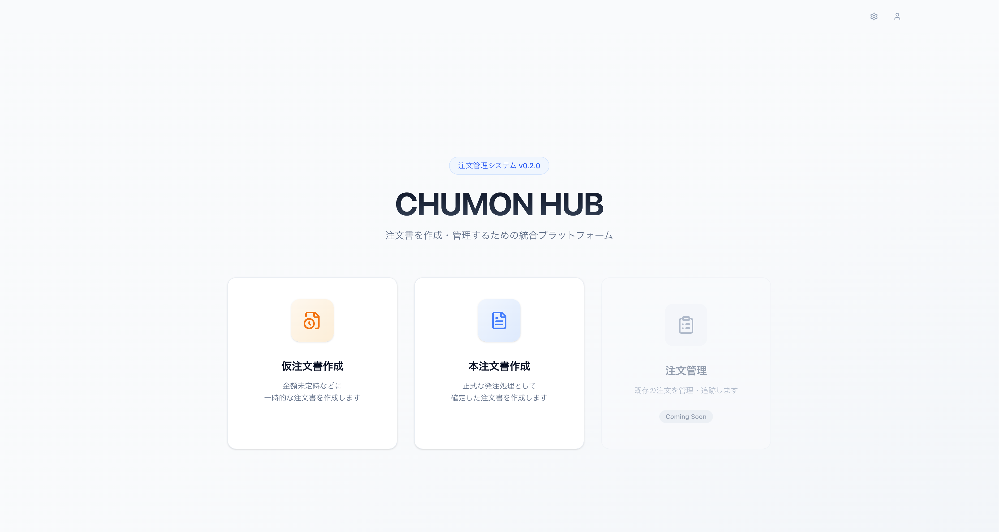
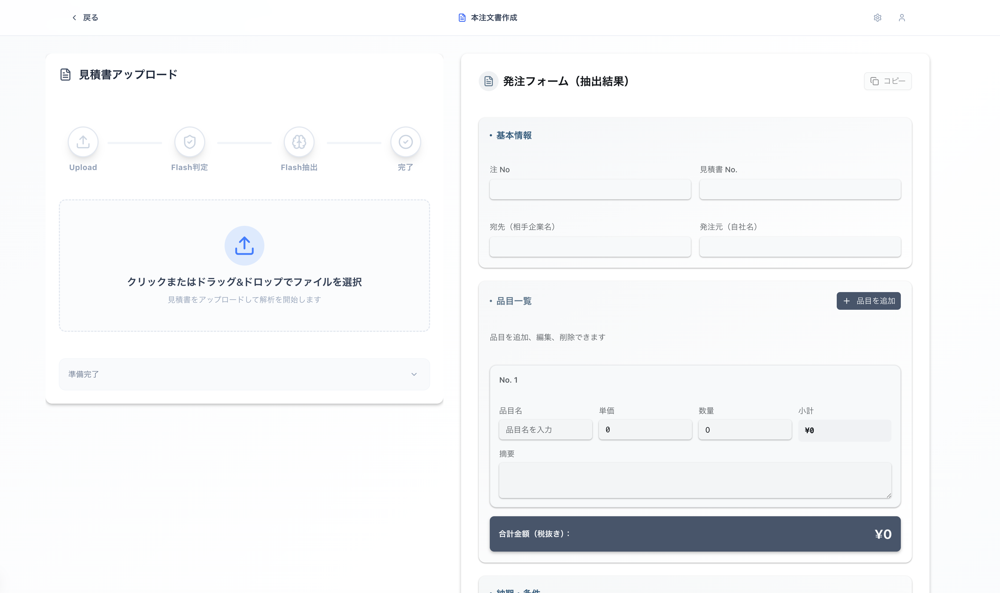
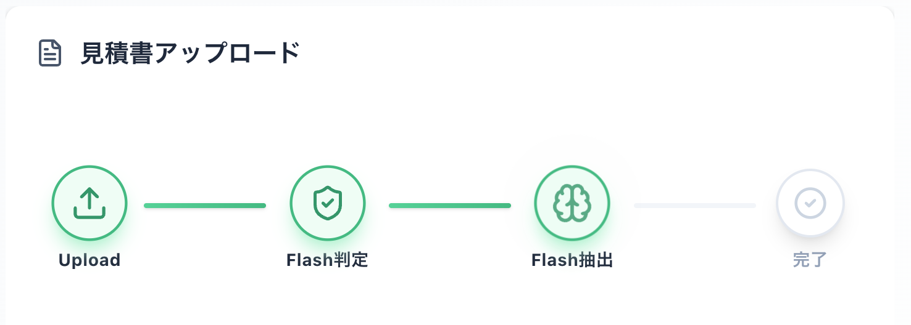

# Chumon Hub (Order Management System)

[](https://v0.dev)
[](https://k3s.io/)
[](https://www.cloudflare.com/products/zero-trust/)
[](https://nextjs.org/)
[](https://opensource.org/licenses/MIT)


> ⚠️ このプロジェクトは開発中（Work in Progress）であり、仕様が頻繁に変更される可能性があります。破壊的な更新が入る場合があります。

AI（Google Gemini API）を活用した注文管理・データ抽出システムです。PDFや画像の注文書から自動的にデータを構造化し、処理プロセスを効率化します。

## 🚀 主な機能

- **AI データ抽出**: Google Gemini API を使用して、注文書（PDF/画像）から注文詳細を自動抽出
- **注文管理フォーム**: Shadcn UI を採用したモダンな入力インターフェース
- **ドキュメント判定**: アップロードされたファイルが適切な注文書かどうかを自動判定

## 📸 スクリーンショットと利用フロー

### ウェブアプリケーションの概要

Chumon Hub は、注文書処理を自動化する直感的なウェブアプリケーションです。ユーザーはホーム画面からドキュメントをアップロードし、AI が自動で注文内容を解析。処理の進捗をリアルタイムで表示し、最終的に抽出されたデータを確認・編集できます。


アプリケーションの入口。PDFや画像をドラッグ＆ドロップでアップロードするか、ファイル選択ダイアログから注文書をアップロードします。


アップロードされたドキュメントが表示されます。ユーザーが注文内容を確認できます。


Google Gemini 2.5 Flash による AI 解析の進捗をリアルタイムで表示します。「ドキュメント判定」「データ抽出」「テーブル構造化」などの各ステップを可視化し、ユーザーに処理状況を伝えます。処理完了後、抽出されたデータが注文管理フォームに自動入力されます。

## 🛠 技術スタック

- **Framework**: [Next.js 16 (App Router)](https://nextjs.org/)
- **Language**: TypeScript
- **Styling**: Tailwind CSS, Shadcn UI
- **AI**: Google Generative AI SDK (Gemini)
- **Container**: Docker (Multi-stage builds)
- **Orchestration**: Kubernetes (K3s)
- **CI/CD**: GitHub Actions

## 💻 ローカル開発環境のセットアップ

### 前提条件

- Node.js 20+
- pnpm
- 1Password CLI (`op`) が使用可能であること（シークレットを 1Password から注入する場合に必須）

### インストール

```bash
# リポジトリのクローン
git clone https://github.com/fumiakic/chumon-hub.git
cd chumon-hub

# 依存関係のインストール
pnpm install
```

### 環境変数の設定

プロジェクトルートに `.env.local` ファイルを作成し、以下の変数を設定してください。

```bash
GOOGLE_API_KEY=your_gemini_api_key_here
API_SECRET=your_generated_random_hex_here  # openssl rand -hex 32 で生成
```

**API_SECRET について**: fileId のセキュリティ強化のため、サーバーサイドで HMAC 署名を付与します。`openssl rand -hex 32` などでランダムな文字列を生成し、本番環境でも設定してください。未設定の場合は開発用デフォルト値が使用されます。

### 開発サーバーの起動

1Password CLI を利用して `.env.local` を読み込む場合（推奨）:

```bash
pnpm dev
# スクリプト内で実行される実体: op run --env-file=.env.local -- next dev
```

1Password CLI を使わない場合（手元に平文で環境変数を保持している場合）:

```bash
next dev
# または pnpm exec next dev
```

どちらの場合も、ブラウザで http://localhost:3000 を開いて確認します。`op` を使う場合は事前に `op signin` を完了させてください。

## 🐳 Docker ビルドと実行

ローカルでコンテナ動作を確認する場合の手順です。

```bash
# Dockerイメージのビルド
docker build -t chumon-hub .

# コンテナの実行
docker run -p 3000:3000 -e GOOGLE_API_KEY=your_api_key chumon-hub
```

## ☸️ K3s へのデプロイ

本番環境は K3s クラスタ上で動作しており、GitHub Actions を通じて自動デプロイされます。

### CI/CD パイプライン概要

- **Build & Push**: main ブランチへのプッシュをトリガーに Docker イメージをビルドし、GHCR (GitHub Container Registry) へプッシュします
- **Deploy**: SSH 経由で K3s ホストに接続し、`kubectl rollout restart` を実行して最新のイメージを反映させます

### マニフェストの適用（初期セットアップ時）

```bash
# Secretの作成（Gemini APIキー、API_SECRET、Cloudflare Access 用ドメイン/オーディエンス）
# 必要な環境変数をまとめてSecretに登録します
# API_SECRETは `openssl rand -hex 32` などで生成したランダムな文字列
kubectl create secret generic chumon-hub-secret \
   --from-literal=GOOGLE_API_KEY=your_google_api_key \
   --from-literal=API_SECRET=your_random_secret_string \
   --from-literal=CLOUDFLARE_TEAM_DOMAIN=your-team-domain \
   --from-literal=CLOUDFLARE_AUDIENCE=your-audience-tag

# GHCR認証用Secretの作成（必要な場合）
# K3sの場合、registries.yamlで設定するか、以下のコマンドでSecretを作成します
kubectl create secret docker-registry ghcr-secret \
  --docker-server=ghcr.io \
  --docker-username=your_github_username \
  --docker-password=your_github_token

# アプリケーションのデプロイ
kubectl apply -f k8s/deployment.yaml
kubectl apply -f k8s/service.yaml
```

## 🔒 セキュリティ設定 (Cloudflare Zero Trust)

本システムは外部からの直接アクセス（ポート開放）を行わず、**Cloudflare Tunnel** を経由して安全に公開されています。
また、**Cloudflare Access** を利用して、認可されたメールアドレスを持つユーザーのみにアクセスを制限しています。

### 1. Cloudflare Tunnel の接続設定

サーバーから Cloudflare エッジへの安全なトンネルを確立するための設定です。

1. **Tunnel の作成**:
   [Cloudflare Zero Trust Dashboard](https://one.dash.cloudflare.com/) > Access > Tunnels から新しい Tunnel を作成し、発行されたトークンをコピーします。

2. **K8s Secret の作成**:
   取得したトークンを Kubernetes クラスターに登録します。
   ```bash
   # <YOUR_TUNNEL_TOKEN> を実際のトークンに置き換えて実行
   kubectl create secret generic tunnel-credentials \
     --from-literal=TUNNEL_TOKEN=<YOUR_TUNNEL_TOKEN>
   ```

3. **Tunnel の起動（重要）**:
   以下のコマンドでトンネル用コンテナを起動します。
   ```bash
   kubectl apply -f k8s/tunnel.yaml
   ```

4. **Public Hostname の設定**:
   Cloudflare Dashboard 上で、公開ドメイン（例: chumon.example.com）と内部サービスを紐付けます。
   - Service: HTTP
   - URL: `chumon-hub-service:3000`

### 2. Cloudflare Access の設定（認証の強制）

1. **アプリケーションの追加**:
   Dashboard > Access > Applications > "Add an application"
   - Type: Self-hosted
   - Application Domain: Tunnelで設定したドメインを入力

2. **アクセスポリシーの作成**:
   - Action: Allow
   - Rules: Emails または Emails Ending in で許可したいメールアドレスを指定

これにより、許可されたメールアドレス以外からのアクセスを完全に遮断します。

## 📂 ディレクトリ構成

```
.
├── app/                       # Next.js App Router ページ
│   ├── api/                   # API Routes
│   │   ├── check-document-type/
│   │   └── extract-order/
│   └── official-order/        # 注文フォームページ
├── components/                # UIコンポーネント (Shadcn UI等)
│   ├── processing-stepper/    # ステッパーコンポーネント
│   └── ui/                    # 基本UIコンポーネント
├── hooks/                     # カスタムフック
├── k8s/                       # Kubernetes (K3s) マニフェスト
│   ├── deployment.yaml
│   ├── service.yaml
│   └── tunnel.yaml
├── lib/                       # ユーティリティ関数
├── public/                    # 静的ファイル
├── types/                     # 型定義
├── .github/workflows/         # CI/CD 設定
├── Dockerfile                 # コンテナ定義
├── next.config.mjs            # Next.js 設定 (Standaloneモード有効化)
└── package.json               # 依存関係管理
```

## 🎨 エラーページ (AI Generated Backgrounds)

Adobe Firefly で生成した背景動画を用いた 404/403 エラーページ実装のデモです。背景の動きとステータスメッセージを重ねることで、ユーザーにフレンドリーなフィードバックを提供します。

| 404 Not Found | 403 Forbidden |
| --- | --- |
|  |  |

## 📜 ライセンスとクレジット

ソースコードは MIT License で提供しています。AI 生成アセット（Adobe Firefly の動画素材や v0.app 生成コード）に関する詳細な権利表記は [NOTICE.md](NOTICE.md) を参照してください。
